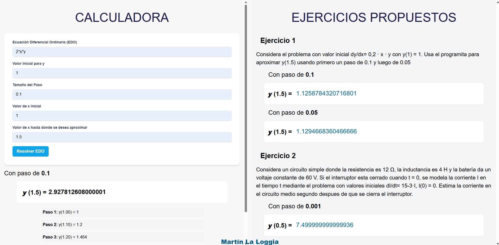
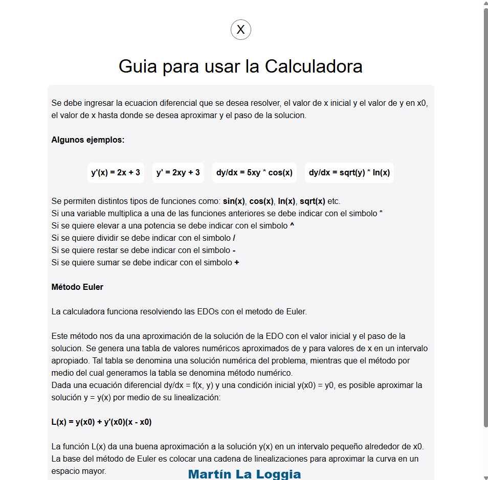

# Solución de EDO por el método de Euler
## React.js + Flask + Tailwind CSS

Desarrollé un servidor/cliente con Python utilizando la librería Flask para correr el servidor y en el cliente utilizo React como librería para las funciones de JS que realizan las peticiones al server y para la creación de componentes reactivos y, junto con Tailwind CSS, puedo dar estilos de manera más sensilla sin tener que escribir CSS como tal. De esta manera logré hacer un sitio sencillo para mostrar los ejercicios y poder resolver EDOs con el método de Euler, el cual nos dá una solución numérica de una EDO con valor inicial.

Este año le actualicé algunas cosas, como correcciones de algunos errores o cosas redundantes en el código. Además añadí para mostrar todos los pasos de como se va resolviendo el problema.
<<<<<<< HEAD
Además añadí para que se pueda ingresar la EDO y no sólo la f(x,y). Ahora acepta distintos formatos, como y', dy/dx, y'(x).

Mejoré la forma de escribir las ecuaciones, permitiendo ingresar funciones matemáticas tales como cos, sen, lg, etc. Y la multiplicación, ahora no hace falta ingresar * para escribir por ejemplo 4xy o xcos(y).

También añadí una guía para poder usar la calculadora y así mejorar la experiencia de usuario.
=======
>>>>>>> bf77c92375532bcdf6d2ed883b75bb327dbaea33

Pasos para poder ejecutar el servidor:

Descargar Flask:
- `pip install flask`

Descargar la librería sympy:
- `pip install sympy`

Descargar la librería numpy:
- `pip install numpy`

Por último descargar CORS:
- `pip install flask_cors`

O puedes instalar todo junto:
- `pip install flask flask_cors sympy numpy`

Para inicializar el servidor ejecuta:
- `python server.py` 

Si dicho comando no funciona prueba con:
- `python3 server.py`

En tu navegador abre el siguiente link:
`http://localhost:5000/`
Espero que les guste!

MARTIN LA LOGGIA
