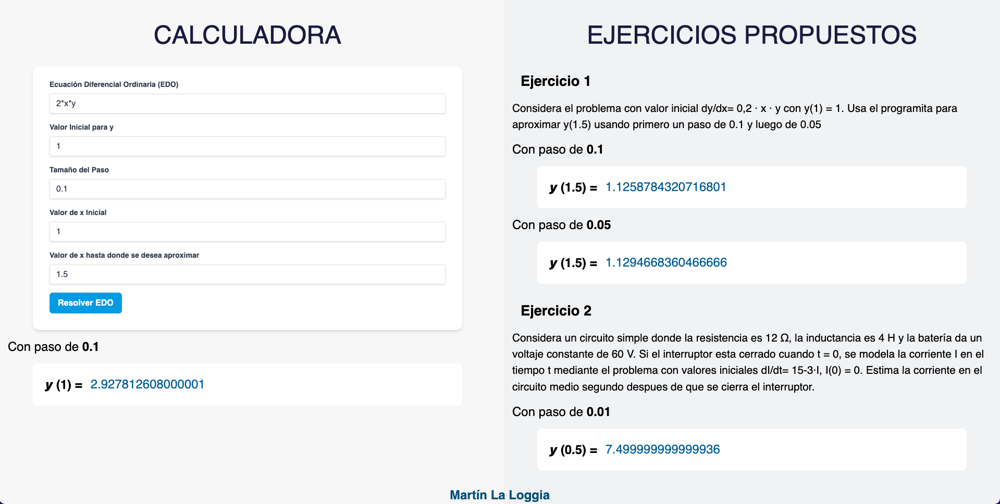

# Solución de EDO por el método de Euler
## React.js + Flask + Tailwind CSS

Desarrollé un servidor/cliente con Python utilizando la librería Flask para correr el servidor y en el cliente utilizo React como librería para las funciones de JS y la creación de componentes reactivos y, junto con Tailwind CSS, puedo dar estilos de manera más sensilla sin tener que escribir CSS como tal. De esta manera logré hacer un sitio sencillo para mostrar los ejercicios y poder resolver EDOs con el método de Euler, el cual nos dá una solución numérica de una EDO con valor inicial.

Pasos para poder ejecutar el servidor:

Descargar Flask:
- `pip install flask`

Descargar la librería sympy:
- `pip install sympy`

Por último descargar CORS:
- `pip install flask_cors`

O puedes instalar todo junto:
- `pip install flask flask_cors sympy`

Para inicializar el servidor ejecuta:
- `python server.py` 

Si dicho comando no funciona prueba con:
- `python3 server.py`

En tu navegador abre el siguiente link:
`http://localhost:5000/`
Espero que les guste!

MARTIN LA LOGGIA
